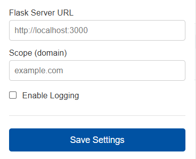
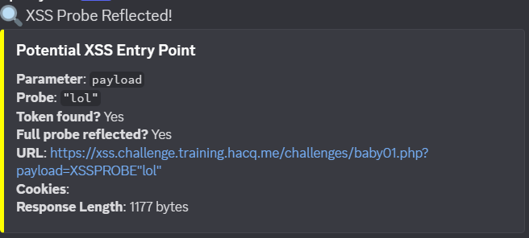

# XSS Sniffer  
### Scoped Reflection & XSS Probe Logger

---

## 🔍 What is XSS Sniffer?

**XSS Sniffer** is a lightweight Chrome extension + Flask backend that helps security researchers quickly identify reflected input points that may lead to XSS vulnerabilities.

Instead of manually testing every parameter, this tool:

- Captures in-scope URLs  
- Injects harmless XSS probe payloads  
- Detects reflection   
- Sends alerts to Discord  
- Logs everything locally  

Built for bug bounty hunters, security researchers.

---

##  Screenshots





---

##  How It Works

1. The browser extension captures URLs within your defined scope.
2. It sends the page URL and cookies to your local Flask server.
3. The backend replaces query parameters with safe probe strings.
4. The response is checked for a unique reflection token.
5. If reflected:
   - Logged locally (`urls.log`)
   - Alert sent to Discord webhook


---

##  Features

- ✅ Scope-based filtering  
- ✅ Automatic query parameter fuzzing  
- ✅ Unique token reflection detection  
- ✅ Discord webhook notifications  
- ✅ Local logging  
- ✅ Lightweight and fast  

---

## 🛠 Installation

### Clone Repository

```bash
git clone https://github.com/AndroByte1/XSS-Sniffer.git
cd XSS-Sniffer
modify DISCORD_WEBHOOK = to your token.
Extension installtion:-
Open browser click load unpacked and select extension folder

